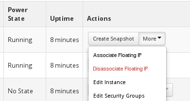

# Lab Overview

In this lab we are going to deploy some atomic hosts, explore Atomic, and setup
an environment for a workload later in this training. We will be deploying 3
hosts, one will later become a master for services like kubernetes, and 2 will
become nodes or "minions" in kubernetes terms. 

**Objective:** By the end of this lab you should have 3 atomic hosts updated to the
latest version.

**Estimated time:** 20 minutes

#**Deployment**
There are many ways to deploy an Atomic Host. In this lab, we provide guidance for OpenStack or local KVM.

Note that Atomic Host can be deployed in a variety of other ways, and supports 
various other hypervisors too, as well as kickstart option. However, to keep 
this training quick and simple we are only providing 2x options here.

##**Deployment Option 1: Atomic Hosts on OpenStack**
You may use an OpenStack service, which needs to have a keypair and a security group already configured.

1. Open up the OpenStack dashboard in a web browser.
1. From the header, navigate to **Instances**. You will see all the instances
within your assigned OpenStack project form this view, not just the instances
that you have created. 
 
1. We need some Atomic host instances for our labs, so click the "Launch
Instances" button to start.
1 On the **Launch Instance** popup window, complete the fields in the tabs as
follows; 
  1. Details tab
  	* Availability Zone: $default
    * Instance name: $username-atomic-host - because we are creating 3 instances, OpenStack will append a UUID to the end of the image name.
    * Flavor: *m1.medium* 
    * Instance count: *3*
    * Instance Boot Source: *Boot from image*
      * Image name: *rhel-atomic-cloud-7.1-6*
  1. Access & Security tab
    * Select your keypair that was uploaded during OpenStack account setup
    * Security Groups: *default*
1. Click "Launch"

Three instances (virtual machines) will be created. It does take some time, so
watch the instance view until the **Power State** is **Running**.

Each instance will start with an internal OpenStack `172.x.x.x` IP address,
which is not routed externally. The structure of this training requires that we
are able to SSH into the external instances, therefore we need to create an
external IP address - OpenStack calls these "Floating IP addresses". 

If there are already some free IP Addresses, and the tentant is configured in
this way, then it will automatically associate a Floating IP address when you
create an instance. Looking at your instances, if it only has a 172.xxx.xxx.xxx
address then you will need to associate a Foating IP address manually. 

### Create external "Floating IP Addresses"

1. In the header, go to "Access & Security", then navigate to the "Floating
IPs" tab.
1. Click "Allocate IP to Project".
1. On the popup window, use a default pool, then click "Allocate IP".
1. You will need 3 addresses, but they do not have to be in sequence - any IP
addresses will do.

### Allocate IP address to instances

Navigate back to the list of instances. On your instances, click the "More"
dropdown in the "Actions" column and click "Associate Floating IP"  



Then you should have some instances that look like this;

### Connect to the Atomic Host instance and verify release

SSH into the VMs with user `cloud-user` and the instance floating IP address. This address will probably be in the `10.3.xx.xx` range.

```
ssh -i <private SSH key> cloud-user@10.3.xx.xxx
```


Once connected, verify that the release version is recent enough. 

```
[cloud-user@jread-atomic-host-22fb5e88-e0f9-4b4c-874f-666eb46173cd ~]$ rpm -qi
redhat-release-atomic-host
Name        : redhat-release-atomic-host
Version     : 7.1
Release     : ***20150219.0.atomic.el7.1***
...
```

##**Deployment Option 2: Atomic Hosts on KVM**

* Grab and extract the Atomic and metadata images from our internal repository.  Use sudo and appropriate permissions.

```
wget [metadata ISO image]
cp atomic0-cidata.iso /var/lib/libvirt/images/.
wget [atomic QCOW2 image]
cp rhel-atomic-host-7.qcow2.gz /var/lib/libvirt/images/.; cd /var/lib/libvirt/images
gunzip rhel-atomic-host-7.qcow2.gz
```

* Make 3 copy-on-write images, using the downloaded image as a "gold" master.

```bash
for i in $(seq 3); do qemu-img create -f qcow2 -o backing_file=rhel-atomic-host-7.qcow2 rhel-atomic-host-7-${i}.qcow2 ; done
```

* Use the following commands to install the images. Note: You will need to change the bridge (br0) to match your setup, or at least confirm it matches what you have.

* For Fedora or CentOS atomic hosts, we need to create cloud init data i.e. atomic0-cidata.iso in below commands. Refer https://www.technovelty.org//linux/running-cloud-images-locally.html

* Use the following commands to install the images. Note: You will need to change the bridge to match your setup, or at least confirm it matches what you have.

```
virt-install --import --name atomic-ga-1 --ram 1024 --vcpus 2 --disk path=/var/lib/libvirt/images/rhel-atomic-host-7-1.qcow2,format=qcow2,bus=virtio --disk path=/var/lib/libvirt/images/atomic0-cidata.iso,device=cdrom --network bridge=br0 --force

virt-install --import --name atomic-ga-2 --ram 1024 --vcpus 2 --disk path=/var/lib/libvirt/images/rhel-atomic-host-7-2.qcow2,format=qcow2,bus=virtio --disk path=/var/lib/libvirt/images/atomic0-cidata.iso,device=cdrom --network bridge=br0 --force

virt-install --import --name atomic-ga-3 --ram 1024 --vcpus 2 --disk path=/var/lib/libvirt/images/rhel-atomic-host-7-3.qcow2,format=qcow2,bus=virtio --disk path=/var/lib/libvirt/images/atomic0-cidata.iso,device=cdrom --network bridge=br0 --force
```

##**Update the Atomic Hosts**

**NOTE:** We will be working on _all three (3)_ VMs. You will probably want to have three terminal windows or tabs open.

* Confirm you can log in to the hosts:

    Username: cloud-user
    Password: atomic (KVM only)

* Enter sudo shell:

```
sudo -i
```

You are not root on the Atomic host. 

* Note that `yum` is **not available** on Atomic host. 

```
-bash-4.2# yum
bash: yum: command not found
```

Instead, we must use the `atomic` command to update this host.

* Update all of the Atomic Hosts. The following commands will subscribe you to receive updates and allow you to upgrade your Atomic Host.  

**NOTE:** Depending on the version of Atomic that you initially installed, some of the sample output below may differ from what you see.

```
# atomic host status
  TIMESTAMP (UTC)         VERSION     ID             OSNAME               REFSPEC                                                 
* 2015-02-17 22:30:38     7.1.244     27baa6dee2     rhel-atomic-host     rhel-atomic-host:rhel-atomic-host/7/x86_64/standard     
```

## Register using subscription-manager

```
-bash-4.2# subscription manager register --auto-attach
Username: <your RHN account>
...
```

# atomic host upgrade

**NOTE:** subscription-manager can sometimes be **very slow**, note that
you should run updates in paralell.

````
-bash-4.2# atomic host upgrade
Updating from: rhel-atomic-host-ostree:rhel-atomic-host/7/x86_64/standard                       
                                                                                                
533 metadata, 2446 content objects fetched; 139407 KiB transferred in 145
seconds               i
Copying /etc changes: 24 modified, 4 removed, 58 added                                          
Transaction complete; bootconfig swap: yes deployment count change: 1  

Changed:                                                                                        
  bind-libs-32:9.9.4-18.el7_1.1.x86_64                                                          
  bind-libs-lite-32:9.9.4-18.el7_1.1.x86_64                                                     
  bind-license-32:9.9.4-18.el7_1.1.noarch      
...
Added:
  atomic-0-0.9.git4ff7dbd.el7.x86_64
Upgrade prepared for next boot; run "systemctl reboot" to start a reboot
```                                                         

Do not reboot yet - we want to check what the update is going to do first of
all. Check the atomic tree version. 

```
-bash-4.2# atomic host status
  TIMESTAMP (UTC)         VERSION     ID             OSNAME
REFSPEC                                                        
  2015-04-02 20:14:06     7.1.1-1     21bd99f9f3     rhel-atomic-host rhel-atomic-host-ostree:rhel-atomic-host/7/x86_64/standard     
* 2015-02-19 20:26:26     7.1.0       5799825b36     rhel-atomic-host rhel-atomic-host-ostree:rhel-atomic-host/7/x86_64/standard     
```

The asterisk indicates the currently running tree. The tree displayed first in
the list is the version that will be booted into. In the output below, if the
system is rebooted, it will boot into the new 7.1.0 tree.

* Reboot the VMs to switch to the updated tree.

```
# systemctl reboot
```

* After the VMs have rebooted, SSH into each and enter the sudo shell:

```
# sudo -i
```

* Check your version with the atomic command. The `*` pointer should now be on the new tree.

```
-bash-4.2# atomic host status
  TIMESTAMP (UTC)         VERSION     ID             OSNAME               REFSPEC                                                        
* 2015-04-02 20:14:06     7.1.1-1     21bd99f9f3     rhel-atomic-host rhel-atomic-host-ostree:rhel-atomic-host/7/x86_64/standard     
  2015-02-19 20:26:26     7.1.0       5799825b36     rhel-atomic-host rhel-atomic-host-ostree:rhel-atomic-host/7/x86_64/standard 
```

# Troubleshooting

1. Subscription manager/`atomic host upgrade` are slow - yes, they are. Have
patience and work in paralell.
1. No updates are found, or atomic cannot update after I have registered with
`subscription-manager` - Quite possibly your RHN account does not have access
to an Atomic subscription. Borrow a RHN account from a friend! 

# Summary

In this lab we created 3 hosts running RHEL Atomic, which will form the basis
of the upcomming labs, where one host will become a Kubernetes Master, and the
other two will become Kubernetes Nodes. 

## [NEXT LAB](exploreAtomic.md)
